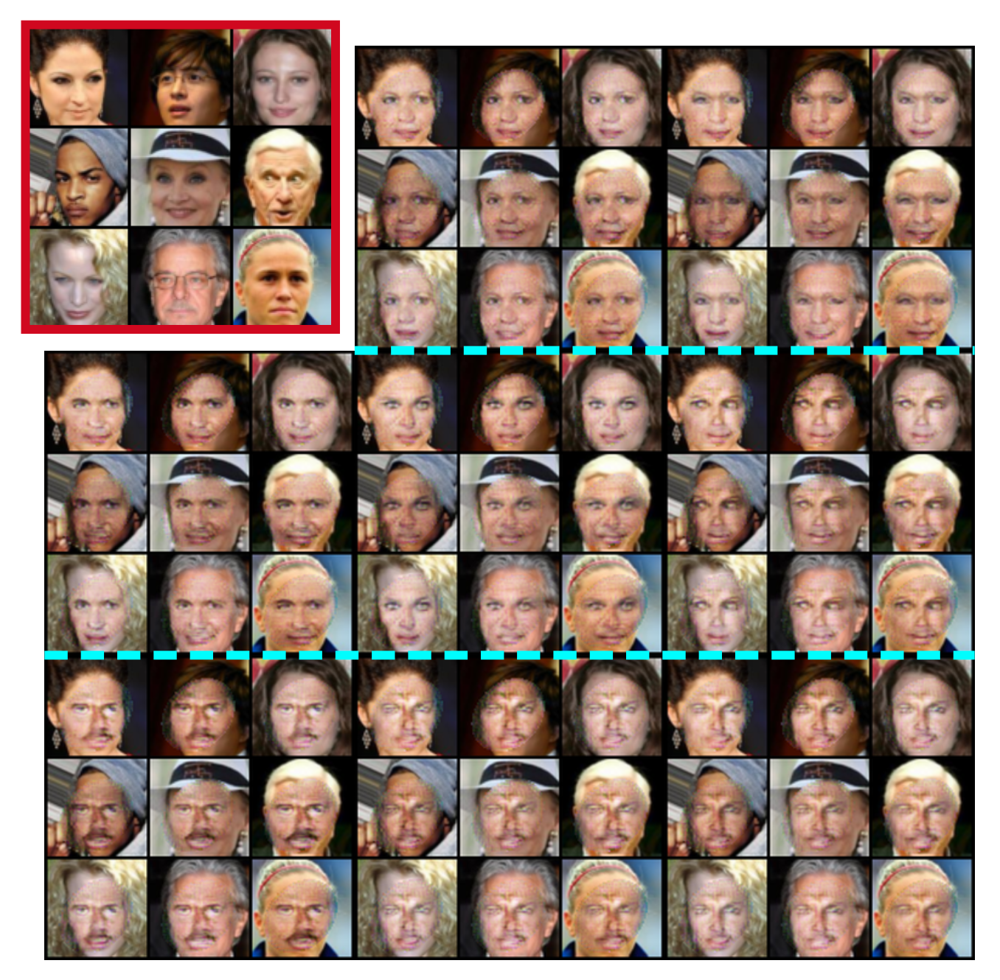

# Region-Selected Generation (RoI-GAN) - Master thesis [UCU]
This GitHub project corresponds to my master thesis at Ukrainian Catholic University (UCU): it this work, I studied the ways how to add control in the local generation using Generative Adversarial Networks. I considered typical works in the image inpainting and controllable generation domains, and after united ideas from these fields to create a model, which allows controlling generation in arbitrary specified region of the interest (RoI). Was performed a comparison between our model, GLCIC and Fast Marching Method on the test part of the CelebA:

Also were inspected controllability properties on CelebA data samples. 

RoI-GAN uses modified SPADE blocks - denormalization layers - and makes two-stage style modulation (like in StyleGAN), with random variable (for control) and with convolved RoI (for mask stylization). To enhance controllability properties, during training was used Mutual Information Maximization between random vector for control and incompressible noise. As the result, we can control the local generation using only a few random variables for it.

Model was validated on the CelebA, Cats and Cars datasets (with 64x64 resolution).
